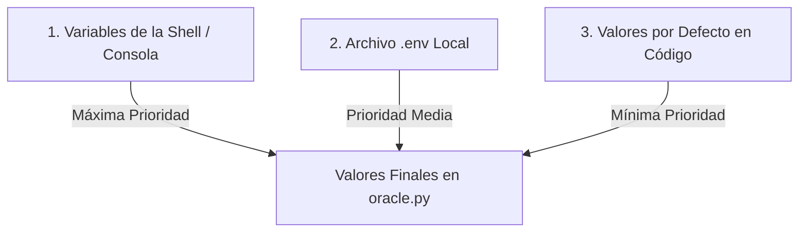

# Módulo 08 - Ejercicio 2: Accessing the Mainframe

## 📋 Descripción General

Este ejercicio (`ex02`) implementa un sistema seguro de gestión de configuraciones y variables de entorno para el proyecto **The Matrix: Welcome to the Real World of Data Engineering** (42 Piscine Python).

El programa `oracle.py` simula el acceso al **Mainframe de la Matrix**, leyendo la configuración de la aplicación de manera dinámica desde variables de entorno o archivos `.env`, garantizando que ninguna clave secreta ni credencial quede escrita de forma rígida (*hardcoded*) en el código fuente.

---

## 📁 Archivos del Proyecto (`ex2/`)

| Archivo | Descripción |
| :--- | :--- |
| `oracle.py` | Script Python principal con anotaciones de tipo, manejo de excepciones y verificación de seguridad. |
| `.env.example` | Plantilla pública con ejemplos de variables de entorno (sin secretos reales). |
| `.gitignore` | Configuración de Git para excluir `.env` y archivos temporales de Python. |
| `Makefile` | Automatización para crear entornos virtuales, ejecutar pruebas, linters y la aplicación. |
| `README.md` | Guía completa de uso, arquitectura y explicación teórica para las evaluaciones. |

---

## ⚙️ Variables de Configuración Requeridas

El programa maneja y valida 5 variables de entorno principales:

1. **`MATRIX_MODE`**: Entorno de ejecución (`development` o `production`).
2. **`DATABASE_URL`**: URI o cadena de conexión a la base de datos (ej. `sqlite:///matrix_dev.db`).
3. **`API_KEY`**: Clave o secreto de autenticación para APIs de la Matrix.
4. **`LOG_LEVEL`**: Nivel de detalle del logging (ej. `DEBUG`, `INFO`, `WARNING`, `ERROR`).
5. **`ZION_ENDPOINT`**: URL de conexión con la red de resistencia en Zion.

---

## 🔐 Orden de Precedencia y Seguridad

En ingeniería de datos y desarrollo backend profesional, la configuración sigue una regla estricta de jerarquía:



### ¿Por qué `.env` NUNCA se sube a Git?
- El archivo `.env` contiene información confidencial (contraseñas, tokens de API, llaves privadas, URLs de base de datos de producción).
- Subir credenciales a repositorios (públicos o privados) expone el sistema a ataques automatizados.
- Por ello, `.env` debe incluirse en `.gitignore`.
- Se proporciona `.env.example` como plantilla para que otros desarrolladores sepan qué variables deben definir en sus propios entornos.

---

## 🚀 Guía de Uso y Comandos (`Makefile`)

El `Makefile` incluido facilita todas las tareas de instalación y prueba:

### 1. Preparar el Entorno y Probar Todo Automáticamente
```bash
make test
```
Este comando:
1. Crea un entorno virtual `.venv` e instala `python-dotenv`, `flake8` y `mypy`.
2. Prueba la aplicación **sin** archivo `.env` (mostrando advertencias de configuración ausente).
3. Prueba la aplicación **con** el archivo `.env` cargado desde `.env.example`.
4. Prueba la sobrescritura dinámica mediante variables de consola de producción (`MATRIX_MODE=production`).

### 2. Ejecutar en Modo Desarrollo
```bash
make dev
# O manualmente:
cp .env.example .env
python3 oracle.py
```

### 3. Ejecutar en Modo Producción (Sobrescritura por Consola)
```bash
make prod
# O manualmente:
MATRIX_MODE=production API_KEY=secret_prod_999 python3 oracle.py
```

### 4. Validar Código con Linters y Typing (Norma 42)
```bash
make lint    # Ejecuta flake8
make mypy    # Ejecuta comprobación de tipos estáticos con mypy
```

### 5. Limpieza de Archivos Temporales
```bash
make clean   # Elimina .venv, .env y __pycache__
```

---

## 🧪 Salidas Esperadas

### Modo Desarrollo (`.env` cargado)
```text
ORACLE STATUS: Reading the Matrix...

Configuration loaded:
Mode: development
Database: Connected to local instance
API Access: Authenticated
Log Level: DEBUG
Zion Network: Online

Environment security check:
[OK] No hardcoded secrets detected
[OK] .env file properly configured
[OK] Production overrides available

The Oracle sees all configurations.
```

### Modo Producción (Sobrescritura en Terminal)
```text
$ MATRIX_MODE=production DATABASE_URL=postgresql://prod.zion.net:5432/main python3 oracle.py

ORACLE STATUS: Reading the Matrix...

Configuration loaded:
Mode: production
Database: Connected to remote production database
API Access: Authenticated
Log Level: DEBUG
Zion Network: Online

Environment security check:
[OK] No hardcoded secrets detected
[OK] .env file properly configured
[OK] Production overrides available

The Oracle sees all configurations.
```

---

## 🎓 Puntos Clave para la Evaluación (Peer-Review)

1. **`load_dotenv()` de `python-dotenv`**:
   Carga las variables definidas en `.env` al diccionario de entorno del sistema (`os.environ`). No sobrescribe variables que ya hayan sido exportadas previamente en la shell, lo que permite sobrescribir ajustes en servidores de integración o producción.

2. **Anotaciones de Tipo (`mypy`)**:
   Todas las funciones cuentan con anotaciones de tipos estrictas (ej. `Dict[str, Optional[str]]` y `-> None`).

3. **Cumplimiento de Estilo (`flake8`)**:
   El código sigue las reglas PEP8 (longitud de línea < 80 caracteres, importaciones ordenadas, docstrings descriptivos).

4. **Verificación de Seguridad Integrada**:
   El script comprueba activamente si `.gitignore` contiene el archivo `.env` antes de reportar un estado seguro.
